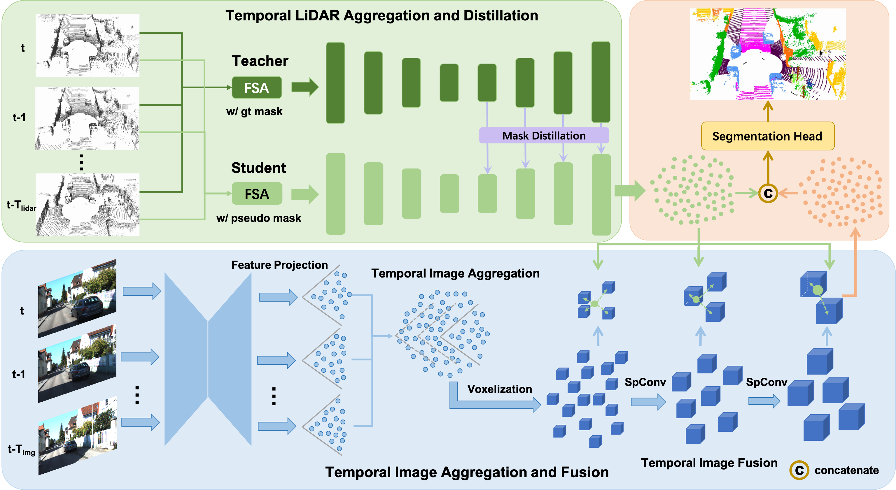

# TASeg: Temporal Aggregation Network for LiDAR Semantic Segmentation (CVPR 2024)
<p align="center">  </p>

This is the official implementation of [**TASeg: Temporal Aggregation Network for LiDAR Semantic Segmentation (CVPR 2024)**](https://arxiv.org/abs/2407.09751), built on [`OpenPCSeg`](https://github.com/PJLab-ADG/OpenPCSeg)

## Installation
Please refer to [INSTALL.md](docs/INSTALL.md) for the installation details.

## Data Preparation
Please refer to [DATA_PREPARE.md](docs/DATA_PREPARE.md) for the details to prepare the [SemanticKITTI](http://www.semantic-kitti.org/tasks.html#semseg) and [nuScenes](https://www.nuscenes.org/nuscenes) datasets.

## Getting Started
Please refer to [GET_STARTED.md](docs/GET_STARTED.md) to learn more usage about this codebase.

## Training TASeg on SemanticKITTI DataSet.
Please refer to [TASeg_Sem.md](docs/TASeg_Sem.md) to train our method on SemanticKITTI dataset.

## Training TASeg on Nuscenes DataSet.
Please refer to [TASeg_Nus.md](docs/TASeg_Nus.md) to train our method on Nuscenes dataSet.

## Citation
If you find this work helpful, please kindly consider citing:
```bib
@inproceedings{wu2024taseg,
title={TASeg: Temporal Aggregation Network for LiDAR Semantic Segmentation},
author={Wu, Xiaopei and Hou, Yuenan and Huang, Xiaoshui and Lin, Binbin and He, Tong and Zhu, Xinge and Ma, Yuexin and Wu, Boxi and Liu, Haifeng and Cai, Deng and others},
booktitle={Proceedings of the IEEE/CVF Conference on Computer Vision and Pattern Recognition},
pages={15311--15320},
year={2024}
}
```

## Acknowledgements
We thank these great open-source codebases:
* [1] https://github.com/PJLab-ADG/OpenPCSeg
* [2] https://github.com/yanx27/2DPASS
* [3] https://github.com/jialeli1/lidarseg3d
* [4] https://github.com/cardwing/Codes-for-PVKD
* [5] https://github.com/mit-han-lab/torchsparse
* [6] https://github.com/TiagoCortinhal/SalsaNext